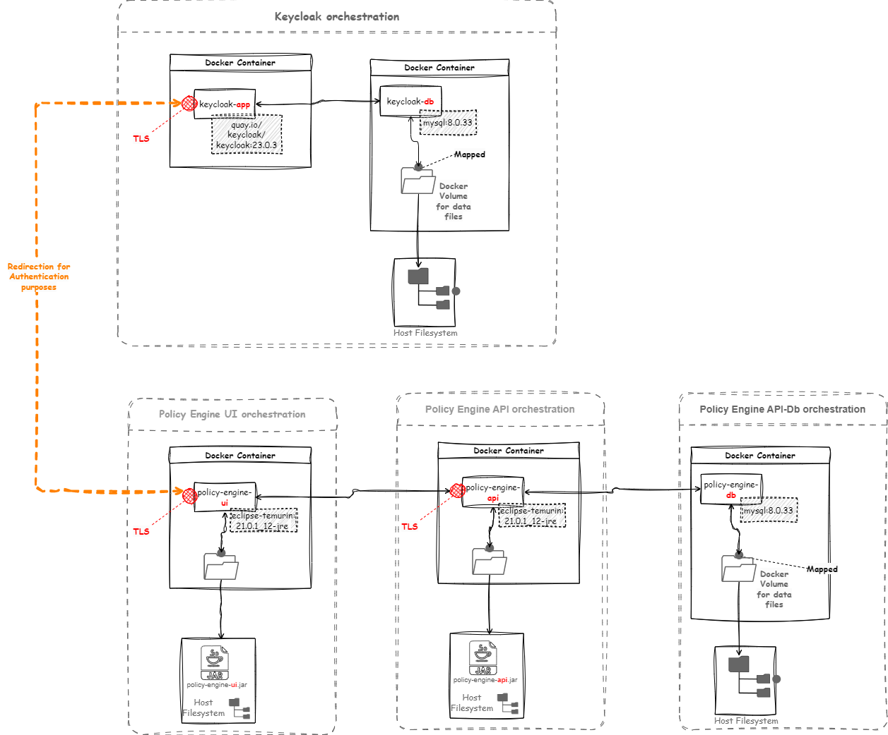
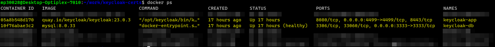
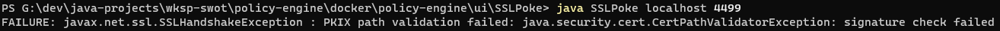
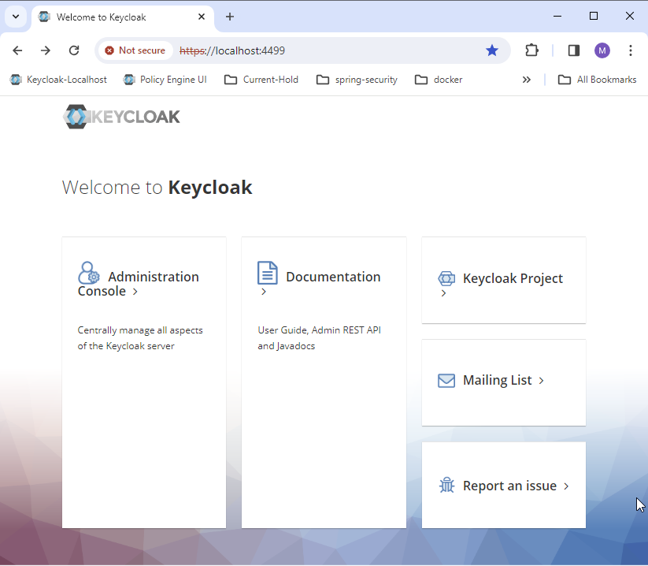
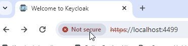
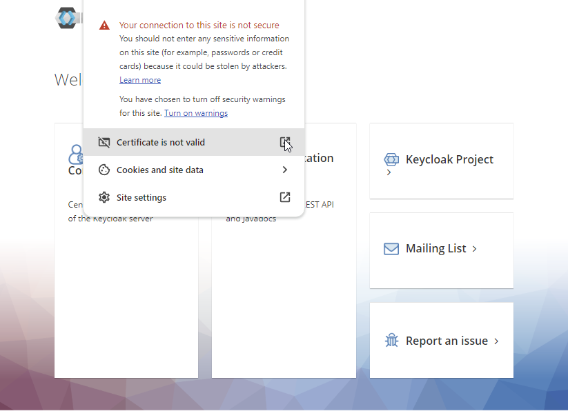
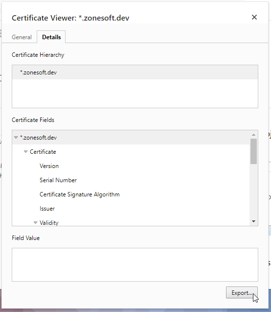
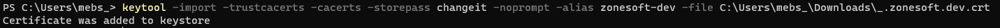
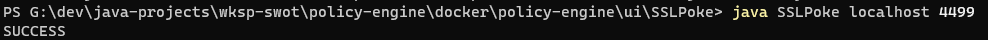

## Overview

The Policy Engine is made up of three main components:-
 - **Keycloak** to provide user authentication services to secure the UI
 - **Policy-Engine-API** to provide the business services that the UI needs
 - **Policy-Engine-UI** the main user application through which the user interacts with the Policy-Engine
 
These components are setup to run within docker containers. Docker compose scripts are used to orchestrate the start of these containers and the diagram below shows their arrangements and setup.

## Setting up and starting Keycloak

### Points to note
 - The Keycloak setup for this project uses a MySql database for it's datastore. 
 - The single docker-compose.yml script starts up the MySql database first then start the Keycloak Application, which depends on the database. 
 - There is an initdb.sql script provided and the first time the docker-compose.yml script is run it uses this sql script to restore an outline configuration exported from a previous setup.
 - For Keycloak to work properly TLS (https) needs to be setup to protect all the web interfaces i.e.
 	 - Endpoints to access Keycloak UI and Authentication Services (API)
 	 - Endpoints to access Policy-Engine-Api
 	 - Endpoints to access Policy-Engine-Ui

### Setting SSL/TLS protection for Keycloak on developers local machine

#### Step-1: Generate a self signed certificate	using openssl
On Windows in the wsl-ubuntu distribution run the following command 
 
`openssl req -config keycloak-cert.config -newkey rsa -x509 -days 3650 -out keycloak.crt` 
 
NB: it requires a config file called keycloak-cert.config. A sample copy of this [file can be found here](./generating-self-signed-certificate/keycloak-cert.config) 
This will generate two files called `keycloak.crt` and `keycloak.key`

#### Step-2: Add the self signed certificates to Keycloak
Copy the the two generated files to the `/policy-engine/docker/keycloak/certs` folder. The docker-compose script is setup to map to these files and use them to enable tls/ssl on keycloak

#### Step-3: Start up Keycloak
- `cd /policy-engine/docker/keycloak` folder.
- run `docker compose up -d` and wait for the container to come up
- Once the docker-compose script completes, check everything is ok with `docker ps`. You should see output as per below

#### Step-4: Check SSL is enabled and working on Keycloak
Test using the `SSLPoke` test utility.
- `cd \policy-engine\docker\policy-engine\ui\SSLPoke`
- run `java SSLPoke localhost 4499`. Now because the self-signed certificate is not yet trusted you should see an error like the one below

- To fix the error we need to trust the self signed certificate, but before we can do that we need to get a copy of the client certificate as shown in the next step

#### Step-5: Get a copy of the client certificate
- navigate to the Keycloak url (https://localhost:4499/) in a browser

- Click on the *Not-Secure* indicator in the address bar

- You should now see a pop up with a message and a link to view the certificate details

- Clicking on export to save the client certificate

#### Step-6: Add the client certificate to the jre keystore

- run the following command to import the client certificate saved in the previous step 
`keytool -import -trustcacerts -cacerts -storepass changeit -noprompt -alias zonesoft-dev -file C:\Users\mebs_\Downloads\_.zonesoft.dev.crt`

- in case there is already a certificate with the same alias and you want to update it with the latest one then you can delete the existing certificate in the keystore with the following command  
`keytool -delete -noprompt -alias zonesoft-dev  -cacerts  -storepass changeit`

#### Step-7: Redo the check (Step-4) to see if SSL is enabled and working on Keycloak
 - This time the check should succeed
 
 
